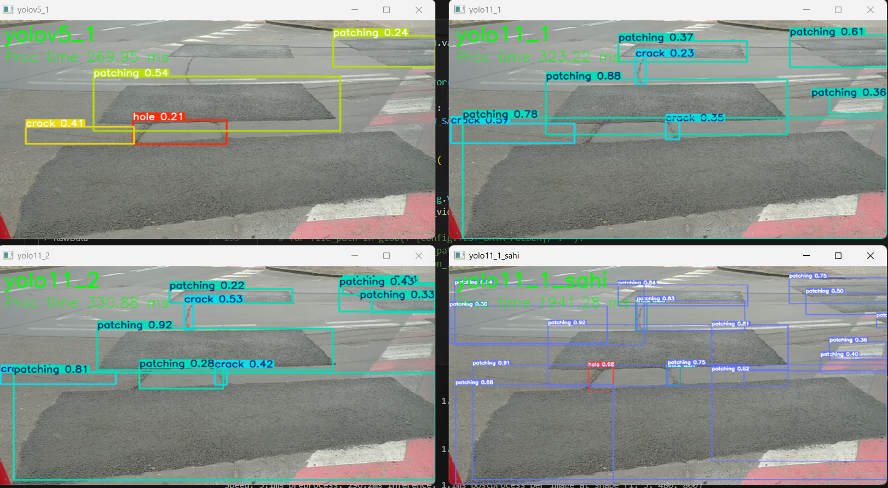
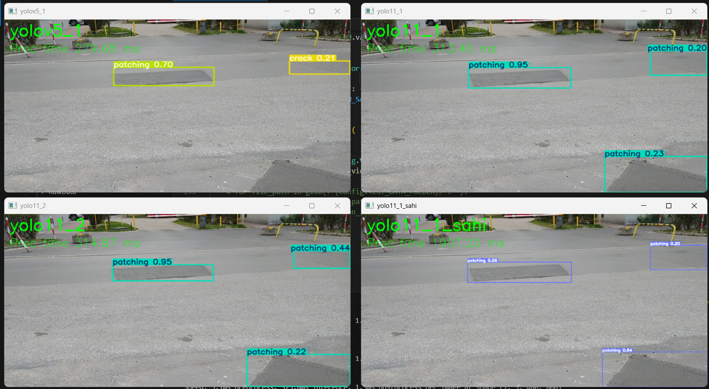
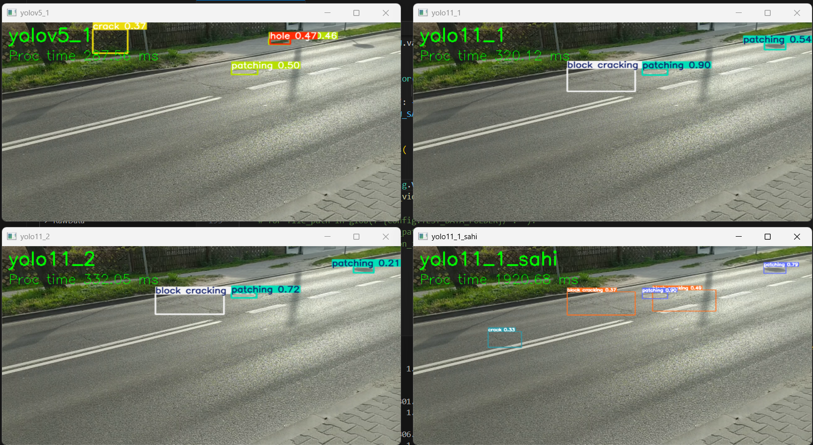
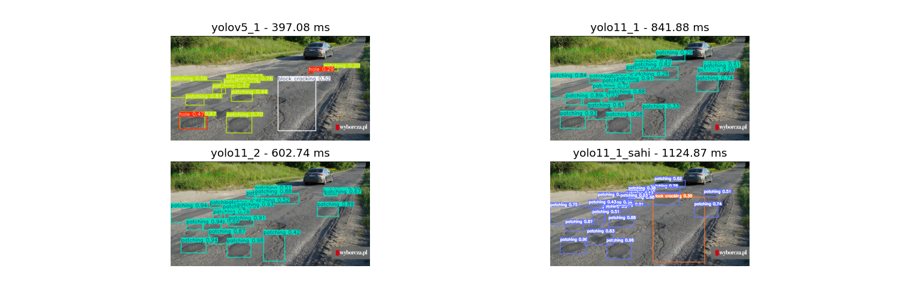
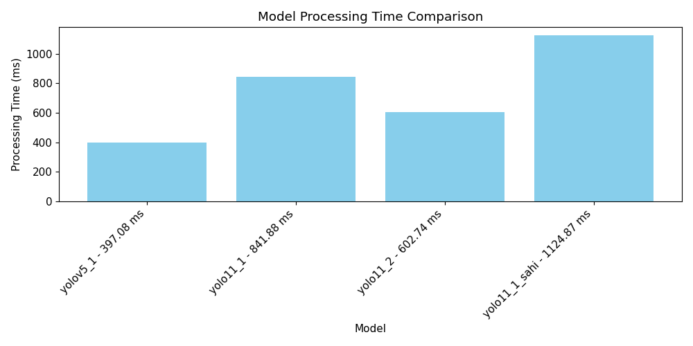
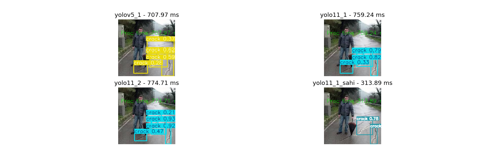
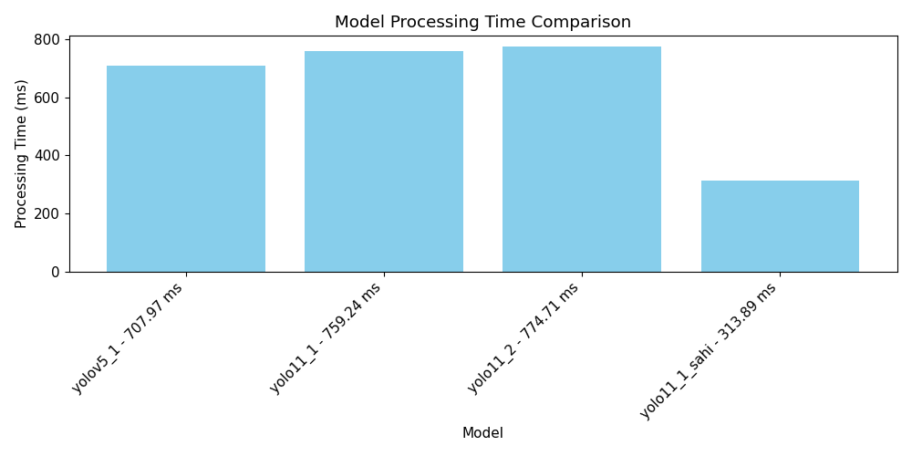

# Road Damage Detector
Road damage detector using YOLO and SAHI.
https://docs.ultralytics.com/
<br>
https://docs.ultralytics.com/guides/sahi-tiled-inference/

[](https://www.youtube.com/watch?v=hdEJjqcZfDg)

## Setup
  - install python 3.11+ (version I use)
  - ```pip install -r requirements.txt```

## Packages
```
filterpy==1.4.5
matplotlib==3.7.1
numpy==1.26.0
opencv_contrib_python==4.10.0.84
opencv_python==4.9.0.80
opencv_python_headless==4.9.0.80
pandas==2.0.2
Pillow==10.3.0
sahi==0.11.22
torch==2.0.1
tqdm==4.65.0
ultralytics==8.3.89
```
## Project Structure
```
├───DatasetPrepTools
│   ├───class_counts.py
│   ├───dataset_cleaner.py
│   ├───move_files.py
│   └───setup_dataset_folder.py
├───models
├───TestData
├───train_data
│   ├───images
│   │   ├───train
│   │   └───val
│   └───labels
│       ├───train
│       └───val
├───Videos
├───models
│   ├───classes.txt
│   ├───yolo11_1_tuned.pt
│   ├───yolo11_1.pt
│   └───yolov5_1.pt
│ 
│   compare_models.py
│   config.py
│   custom_logger.py
│   custom_decorators.py
│   config.py
│   sort_tracker.py
│   requirements.txt
│   yolo_detector_old.py
│   yolo_detector.py
```
## Detectors
### <u>***yolo_detector_old.py***</u>
Detector for yolov5, nothing fancy.
#### **Attributes:**
| Attribute | Type | Default | Description |
|-----------|------|---------|-------------|
| `model_path` | `str` | - | Path to the YOLOv5 model weights file (required) |
| `conf_threshold` | `float` | 0.1 | Confidence threshold for filtering detections |
| `ultralytics_path` | `str` | "ultralytics/yolov5" | Path to the ultralytics YOLOv5 implementation |
| `model_type` | `str` | "custom" | Type of model to load ("custom" or pre-trained) |
| `force_reload` | `bool` | True | Whether to force reload the model |

#### **Methods:**
`detect` - detection function that processes an image and returns detection results.
#### **Parameters:**
 - `img`: `Union[str, np.array]` - Numpy image or path to an image.

#### **Returns:**
- `Tuple[np.array, pd.DataFrame]` - Image with drawn detections, dataframe with detections.

### **Basic usage:**
```python
yolo_predictor = YoloDetector(
        model_path=model_path,
)
image = cv2.imread(image_path)
converted = cv2.cvtColor(frame, cv2.COLOR_BGR2RGB)
image_draw, res = detector.detect(img=converted)

for detection in res:
    bbox, conf, obj_id, class_id = detection[:4], *detection[4:]
cv2.imshow("res", image_draw)
cv2.waitKey(0)
```

### <u>***yolo_detector.py***</u>
Detector for yolov11, for both regular and sahi version.

| Attribute | Type | Default | Description |
|-----------|------|---------|-------------|
| `model_path` | `str` | - | Path to the YOLOv11 model weights file (required) |
| `classes_path` | `str` | - | Path to model classes (required) |
| `device` | `str` |  `"cpu"` | Device ("cpu", "cuda:0") |

### **Methods:**
`detect` - detection function that processes an image and returns detection results.

#### **Parameters:**
 - `images`: `List[np.array]` - List of numpy images.
 - `conf`: `float` - Detection confidence threshold (0-1.0).
 - `iou`: `float` - Intersection Over Union (IoU) threshold for Non-Maximum Suppression (NMS). Lower values result in fewer detections by eliminating overlapping boxes, useful for reducing duplicates.
 - `augment`: `bool` - Enables test-time augmentation (TTA) for predictions, potentially improving detection robustness at the cost of inference speed.
 - `agnostic_nms`: `float` - Enables class-agnostic Non-Maximum Suppression (NMS), which merges overlapping boxes of different classes. Useful in multi-class detection scenarios where class overlap is common.

#### **Returns:**
  - `List[tuple]` - return list of tuples, each tuple contains pair of detection data and image with drawn detections.

<br>
<hr>

`detect_with_sahi` - detection function that processes an image and returns detection results BUT with **SAHI** (Slicing Aided Hyper Inference - https://docs.ultralytics.com/guides/sahi-tiled-inference/), which helps a lot in detecting really small objects.

#### **Parameters:**
 - `images`: `List[np.ndarray]` - List of numpy images.
 - `conf`: `float` - Confidence threshold.
 - `slice_height`, `slice_width`: `int` - The larger the better detection of smaller objects but longer processing time.
 - `overlap_height_ratio`, `overlap_width_ratio`: `int` - Slice overlay.

#### **Returns:**
 - `List[tuple]` - return list of tuples, each tuple contains pair of detection data and image with drawn detections.

<br>
<hr>

`yield_data` - Method for yielding detection data from `detect` method.
#### **Parameters:**
 - `bbox`: `Boxes` - Detection data from `detect`.
#### **Returns:**
 - `Generator` - processed detection data into: `cls_id, class_name, conf,  (x1, y1, x2, y2)`

 <br>
<hr>

`yield_sahi_data` - Method for yielding detection data from `detect_with_sahi` method.
#### **Parameters:**
 - `sahi_result`: `PredictionResult` - Detection data from `detect_with_sahi`.
#### **Returns:**
- `Generator` - processed detection data into: `cls_id, class_name, conf, (x1, y1, x2, y2)`

### **Basic usage:**
```python
yolo_predictor = YoloDetector(
        model_path=model_path,
        classes_path=classes_path
)
image = cv2.imread(image_path)
res, res_img = yolo_predictor.detect(images=[image])[0]
#res, res_img = self.yolo_detector.detect_with_sahi(images=[frame])[0]

detection_res_gen = self.yolo_detector.yield_data(bbox=res)
# detection_res_gen = self.yolo_detector.yield_sahi_data(sahi_result=res)
for detection in detection_res_gen:
    class_id, _, conf, x1, y1, x2, y2 = *detection[:3], *detection[3]
cv2.imshow("res", res_img)
cv2.waitKey(0)
```
## Model comparison
In order to copare models use `compare_models.py`. It compare on both images and videos.

#### **Model configuration**
Prepare model configuration dict:
```python
models = {
    "yolov5_1": {
        "detector": Detector(model_path=f"{Config.MODELS_PATH}/yolov5_1.pt", conf_threshold=.2),
        "type": ModelTypes.OLD.value
    },
    "yolo11_1": {
        "detector": YoloDetector(model_path=f"{Config.MODELS_PATH}/yolo11_1.pt", 
                                    classes_path=f"{Config.MODELS_PATH}/classes.txt"),
        "detector_func_params": {"conf": .2, "iou": .35, "augment": True, "agnostic_nms": True},
        "type": ModelTypes.NEW.value
    },
    "yolo11_2": {
        "detector": YoloDetector(model_path=f"{Config.MODELS_PATH}/yolo11_2.pt", 
                                    classes_path=f"{Config.MODELS_PATH}/classes.txt"),
        "detector_func_params": {"conf": .2, "iou": .35, "augment": True, "agnostic_nms": True},
        "type": ModelTypes.NEW.value
    },
    "yolo11_1_sahi": {
        "detector": YoloDetector(model_path=f"{Config.MODELS_PATH}/yolo11_1.pt", 
                                    classes_path=f"{Config.MODELS_PATH}/classes.txt"),
        "detector_func_params": {"slice_height": 480, "slice_width": 480},
        "type": ModelTypes.NEW_SAHI.value
    },
}
```
#### **Visual configuration**
Both image and video methods have some options that allow to customize visualiztion a little bit.

 - **compare_on_video:**
   - `cols`: `int`
   - `start_y`: `int`
   - `x_padding`: `int`
   - `y_padding`: `int`
   - `display_width`: `int`
   - `display_height`: `int`

- **compare_on_images:**
   - `figsize1`: `tuple` - size of main graph (with actual predictions)
   - `figsize2`: `tuple` - size of graph with execution times for each model
   - `rows`: `int`

#### **Results**









**Yolov11 seem to perform better than yolov5**, Yolov11 with **SAHI can detect smaller details** but it's not always better solution than regular Yolov11, the other factor is that SAHI is most cases takes more time to process, **while regular yolov5 and 11 are faster**.

## Road Damage Detection
Main functionality sits in **main.py** file, which uses few other modules:
 - **config.py** - Managing configuration.
 - **sort_tracker.py** - Providing SORT algorithm for tracking detection object.
 - **yolo_detector.py** - YOLO detector.
 - **custom_decorators.py** - Providing extra functionality, mostly for logging.
 - **custom_logger** - Providing logger.

### <u>***main.py***</u>
Main file lol.
#### **Attributes:**
| Attribute | Type | Default | Description |
|-----------|------|---------|-------------|
| `model_path` | `str` | value from `Config.MODEL_PATH` | Path to the YOLOv11 model.
| `classes_path` | `str` | value from `Config.CLASSES_PATH` | Path to the classes path.
| `device` | `str` | value from `Config.DEVICE` | Device.
| `sort_max_age` | `int` | value from `Config.SORT_MIN_HITS` | Max age of tracked object - for example if set to 5 object will be lost if not seen for 5 frames.
| `sort_min_hits` | `int` |  value from `Config.SORT_MIN_HITS`| How many times obejct has to be seen in order to be tracked. 
| `sort_iou_threshold` | `int` | value from `Config.SORT_IOU_THRESHOLD` |Intersection Over Union (IoU) threshold - it's used to "recognize" if it's the same object, for example if set to 0.3 boxes have to align in 30% in order to tell if it's the same object.

#### **Methods:**

**`process_frame`** - method for processing single frame/image - making detections and tracking.

#### **Parameters:**
 - `frame`: ` np.array`
 - `use_sahi`: `bool`
 - `conf`: `float` - Confidence threshold for regular YOLO models.
 - `iou`: `float` - IOU for regular YOLO models.
 - `augment`: `bool` - Augment for regular YOLO models.
 - `sahi_conf`: `float`
 - `sahi_slice_height`: `int`
 - `sahi_slice_width`: `int`
 - `sahsahi_overlap_height_ratioi_conf`: `float`
 - `sahi_overlap_height_ratio`: `float`
 - `detection_history`: `defaultdict[int]` - Detection history, used to avoid counting the same object over and over again.
 - `track`: `bool` - Tracking objects with SORT algorithm.
 - `min_det_frames`: `int` - Used to avoid counting objects that appeared for a frame or two, so object has to appear X times in order to be counted, **if you're working with just one image not frame stream you can set it to 0.**
 - `font_size`: `float`
 - `font_thick`: `int`
 - `bbox_thick`: `int`

 #### **Returns:**
 - `tuple[np.array, np.array, dict, np.array, Generator]` - Returns frame raw with detections, frame with processed detections , summary, tracking data, detection generator.

<br>
<hr>

**`process_video`** - same thing as `process_frame` but for video and with drawing FPS and count summary.

#### **Parameters:**
  - `vid_cap`: `Union[int, Path, str]`
  - **rest is the same as in `process_frame`**
#### **Returns:**
 - `None`

 **`draw_summary`** - drawing count summary.
 #### **Parameters:**
  - `frame`: `np.array`
  - `summary`: `dict`
  - `x`: `int` - Where summary starts in x axis.
  - `y`: `int` - Where summary starts in y axis.
  - `font_size`: `float`
  - `font_thick`: `int`
  - `color`: `tuple[int, int, int]`
  - `y_step`: `int` - Steo between each class count.
#### **Returns:**
 - `None`

<br>
<hr>

**`draw_bbox`** - drawing object bbox.
#### **Parameters:**
  - `img`: `np.ndarray`
  - `bbox`: `Tuple[int, int, int, int]`
  - `class_name`: `str`
  - `obj_id`: `int`
  - `conf`: `float`
  - `font_thick`: `int`
  - `font_size`: `float`
  - `colors`: `dict` - Colors for each class.
  - `bbox_thick`: `int`
#### **Returns:**
 - `None`

## Dataset Preparation Tools and Training model
Train YOLOv5: https://github.com/Koks-creator/HowToTrainCustomYoloV5Model
<br>
Train YOLOv11: use **yolov11.ipynb** notebook, rest is almost the same, almost since you just need to upload train_data.zip into google drive, change few parameters (**CLASS_NAMES** for example).

Tools in the `DatasetPrepTools` directory:
- `setup_dataset_folder.py` - Creates training dataset folder structure.
- `move_files.py` - Splits data into training/validation/test sets.
- `dataset_cleaner.py` - Filters and processes raw dataset.
- `class_counts.py` - Analyzes class distribution.

## Logging and decorators

### Logging
Logging tools are handled by `custom_logger.py` it logs to both file and CLI.

### Decorators
Logging decroators because I like logging - `custom_decorators.py`.

**`timeit`**
#### **Parameters:**
 - `logger`: `Logger` - you can log execution time.
 - `print_time`: `bool` - or not, you can just print it.
 - `return_val`: `bool` - you can also return execution time.

 <hr>
 <br>

**`log_call`**
#### **Parameters:**
 - `logger`: `Logger` - you can log execution time.
 - `log_params`: `list` - list of parameters of method you want to log, sometimes you don't want to log some stuff, so you can choose only the ones you are interested in or you can set it to `[""]` to not log anything.
 - `hide_res`: `bool` - show (or not) retuned data.
